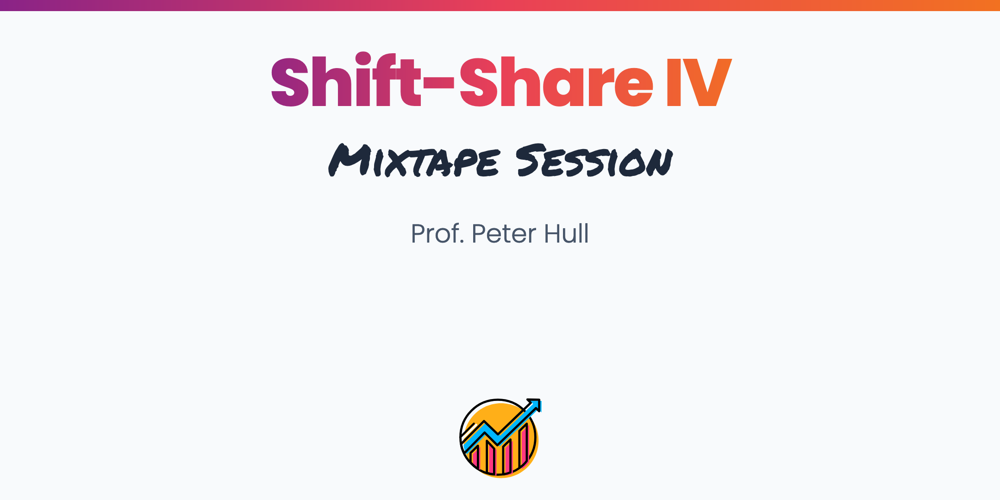

 
 

 

Shift-Share Instrumental Variables (SSIV) are used to address endogeneity and selection challenges in many economic settings. This half-day workshop will introduce the basics of SSIV and cover the recent literature on its econometric foundations. Special focus will be paid on the different assumptions underlying the “exogenous shares” and “exogenous shocks” approaches to SSIV identification, and their practical implications. We will also cover a more general class of instrumental variable strategies combining exogenous shocks and non-random exposure. Group programming exercises will be used to illustrate various theoretical concepts in real-world applications.
 

  
 
 

<b>Introduction</b>
 

<b>About</b>

- Introducing Shift-Share IV: Recent Applications

<b>Slides</b>

<b>Readings</b>

<a href="https://raw.githubusercontent.com/Mixtape-Sessions/Instrumental-Variables/main/Readings/Lecture4/Adao_Kolesar_Morales_2019.pdf">Adao, Kolesar, and Morales (2019)</a>

<a href="https://raw.githubusercontent.com/Mixtape-Sessions/Instrumental-Variables/main/Readings/Lecture4/Borusyak_Hull_2021.pdf">Borusyak and Hull (2021)</a>

<a href="https://raw.githubusercontent.com/Mixtape-Sessions/Instrumental-Variables/main/Readings/Lecture4/Goldsmith-Pinkham_Sorkin_Swift_2020.pdf">Goldsmith-Pinkham, Sorkin, and Swift (2020)</a>

<a href="https://raw.githubusercontent.com/Mixtape-Sessions/Instrumental-Variables/main/Readings/Lecture4/Borusyak_Hull_Jaravel_2022.pdf">Borusyak, Hull, and Jaravel (2022)</a>

 

<b>The “Exogenous Shares” Approach (Goldsmith-Pinkham et al. 2020)</b>
 

<b>About</b>

<b>Slides</b>

<b>Readings</b>

 

<b>The “Exogenous Shocks” Approach (Borusyak et al., 2022)</b>
 

<b>About</b>

<b>Slides</b>

<b>Readings</b>

 

<b>Practical Implications from Exogenous Shares vs. Shocks</b>
 

<b>About</b>

<b>Slides</b>

<b>Readings</b>

 

<b>Beyond SSIV: Non-Random Exposure to Exogenous Shocks (Borusyak and Hull, 2022)</b>
 

<b>About</b>

<b>Slides</b>

 

<b>Conclusion</b>
 

<b>About</b>

<b>Slides</b>

 
